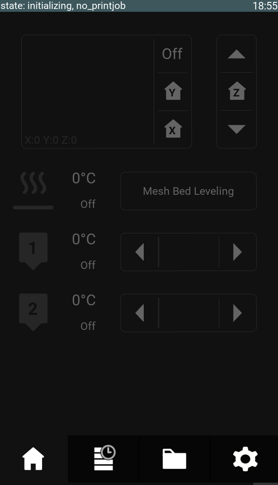

# kgui is the clean touch UI for your 3D Printer running Klipper.
It's compatible with common chinese 7 inch 1024*600 touch screens.
This plugin works best in conjunction with the [klipper_cura_connection](https://github.com/Gobbel2000/klipper_cura_connection) plugin.
Due to using a modified version of Klipper, mainsail is not currently supported.
# Features
* Filemanager for printing from USB-sticks
* Easy setup of Wifi, timezone
* Tune parameters while Printing
  * Acceleration
  * Linear Advance
  * Z-Height
  * Temperature
  * Fan speed
  * Print Speed
* Accurate and instant print time predictions (with Cura gcode)
* Support for decompressing zip-compressed gcode (Cura .ufp files) on the fly
* Material tracking, keep track of your spools and material use by choosing wich material you load with the automatic loading procedure
* A print queue. Add as many printjobs as you like, new jobs will start in paused state
* A printjob history, to easily find and reprint past printjobs

[Installation Guide](https://github.com/D4SK/kgui/blob/master/Installation.md)

